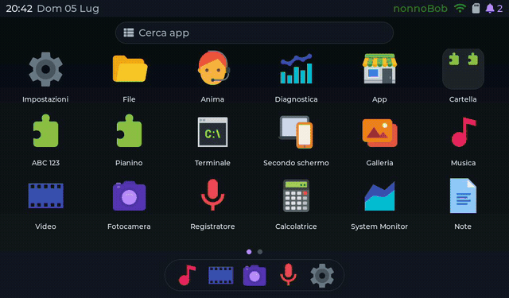
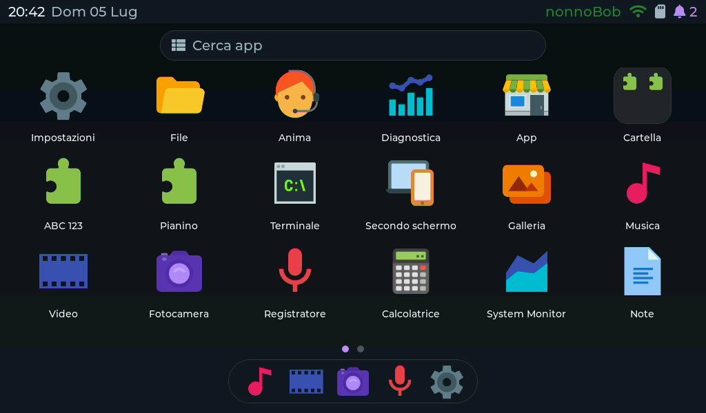
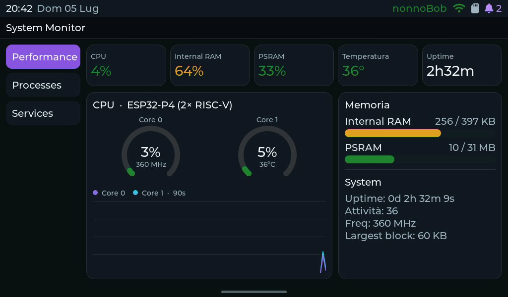
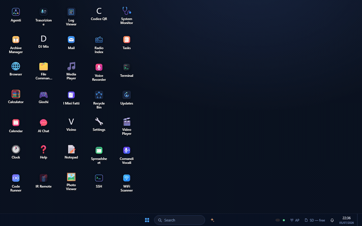

# NucleoOS P4 · custom firmware / OS for the Guition JC1060P470C (ESP32-P4 7" display)

**Turn the Guition ESP32-P4 7" touchscreen (JC1060P470C_I_W) into a real little computer:**
a touch launcher, 15 built-in apps, an app store (its own apps plus 150 WASM-4 community games), a
WebAssembly runtime, a desktop in your browser, and signed updates over Wi-Fi. Flash it from Chrome
in a few minutes, no toolchain needed.

What is verified on the board and what is still experimental is listed feature by feature in
[`docs/STATUS.md`](docs/STATUS.md).

[](https://indecenti.github.io/nucleoos-p4-store/flash/)
[](https://github.com/indecenti/NucleoOS-P4/releases/latest)
[](https://indecenti.github.io/nucleoos-p4-store/)


[](https://github.com/indecenti/NucleoOS-P4/actions/workflows/ci.yml)


<p align="center">
  
</p>

| Launcher | App Store: 150 WASM-4 games | A WASM-4 game, touch gamepad |
|---|---|---|
|  |  |  |
| **Weather** (store app) | **Pomodoro Desk Hub** (store app) | **System Monitor** |
|  |  |  |

*Live captures from the device, 1024×600.*

## Install in 3 steps

1. **Open the [web flasher](https://indecenti.github.io/nucleoos-p4-store/flash/)** in Chrome or
   Edge, plug the board in with a USB-C data cable, press *Connect & install*.
2. **Insert a FAT32 microSD** (apps, media and OTA updates live there). Optional: unzip
   `nucleoos-p4-sdcard.zip` from the [release](https://github.com/indecenti/NucleoOS-P4/releases/latest)
   onto it for the web companion.
3. **Join Wi-Fi** in Settings. From then on the board updates itself and installs apps from the Store.

Prefer the command line? Each [release](https://github.com/indecenti/NucleoOS-P4/releases/latest)
has a single factory image:
`esptool.py --chip esp32p4 write_flash 0x0 nucleoos-p4-<version>-jc1060p470c-factory.bin`

> Needs an ESP32-P4 chip revision v0.x/v1.x, which covers every board sold so far. On a v3 chip
> the bootloader just won't start, and the stock firmware can be flashed back.

## What you get

### App store, installed over Wi-Fi
- **150 WASM-4 fantasy-console games** by the WASM-4 community (2048, Break-It, Cosmic Inv4ders,
  Glitch Dungeon, …), each under its author's license, full-screen with an on-screen gamepad or a
  USB keyboard
- **Terminal programs**: Lua 5.4, JavaScript (QuickJS-ng, ES2024), SQLite shell, BASIC, JSON,
  Markdown and Zip tools, running as WASI console apps on the SD card
- **Apps**: Weather (Open-Meteo, no API key), Pomodoro Desk Hub, Timer, kids' apps (ABC 123 with
  voice, Pianino), and more
- Every package is signed; the device refuses unsigned or altered ones and asks before an app
  gets network access. Categories, search, 5 languages. The catalog is static on GitHub Pages:
  [browse it](https://indecenti.github.io/nucleoos-p4-store/)

### Built-in apps
Settings · Files · Camera (photo + MJPEG video) · Gallery (hardware JPEG) · Music
(MP3/WAV, background playback) · Video (MJPEG .avi and MPEG-1 .mpg, tear-free) · Voice
Recorder (experimental) · Notes · Calculator · Terminal ([shell reference](docs/SHELL.md)) · Tasks · System Monitor · Diagnostics · Second Screen ·
**Anima**, the assistant (offline commands and memory, optional cloud LLM with your own key)

### A desktop in your browser
Open the board's IP in any browser and you get a windowed web OS with ~35 apps (files,
spreadsheet, media, terminal, system monitor…) talking to the device over a REST API.

<p align="center">
  
</p>

### The system underneath
- **LVGL 9 launcher**: adaptive grid, pages, folders, smart dock, wallpapers, search, rotation, multitouch (5 points)
- **Wi-Fi 6 via the ESP32-C6**, automatic **signed OTA updates** from GitHub, A/B partitions with rollback
- **5 languages** (IT/EN/ES/FR/DE), **offline text-to-speech** in Italian and English
- **USB host**: keyboard, mouse, USB audio output; gamepads and USB drives are experimental
- **Hardware acceleration**: JPEG codec, PPA scaling/rotation, double-buffered display with vsync swap
- RAM discipline: one app resident at a time, a PSRAM broker that reclaims caches before heavy work

### For developers
- **Write apps in C → WebAssembly** with the SDK in [`sdk/`](sdk/): graphics surface, touch
  (multi-point), audio, voice, networking (UDP), files (WASI), file associations
- **AOT compilation** (WAMR `wamrc`) for native speed on the P4's RISC-V cores, with interpreter fallback
- **Hot-reload over Wi-Fi**: push a `.wasm` from the PC and it restarts on the device
- Remote UI automation and screenshots over HTTP (`/api/ui/*`, `/api/screen`); the API is paired:
  a 6-digit code on the device screen, then a session token (`python tools/pair.py` for PC tools)
- Architecture: [`ARCHITECTURE.md`](ARCHITECTURE.md) · app guide: [`docs/WASM_APPS.md`](docs/WASM_APPS.md) · game guide: [`docs/GAME_DEV.md`](docs/GAME_DEV.md) · feature status: [`docs/STATUS.md`](docs/STATUS.md)

## Engineering and testing
- **CI on every commit** ([`ci.yml`](.github/workflows/ci.yml)): clean ESP-IDF build from pinned
  dependencies, a check that the lock file did not drift, and **memory budgets** (internal static
  RAM and IRAM) that fail the build when exceeded.
- **Host tests and fuzzers** ([`tests/host`](tests/host)): every parser that reads untrusted input
  (AVI, MP4, MPEG-1, web paths and queries, OTA manifests, store packages, pairing, app network
  policy, Home Assistant replies) has unit tests and a libFuzzer target, run under AddressSanitizer
  and UBSan as 64-bit and 32-bit builds, since the P4 is 32-bit. A weekly job fuzzes longer. The
  fuzzers already found path-guard bypasses in the web API and hangs and out-of-bounds reads in
  the MPEG-1 decoder; all fixed, each with a regression test.
- **Hardware in the loop** ([`tools/hil/smoke.py`](tools/hil/smoke.py)): opens and closes every app on
  the board, watching for reboots, freezes and memory leaks, plus a Wi-Fi soak test.
- **Crash forensics**: coredumps and an interrupt-storm watchdog are kept across reboots and served at
  `/api/crash`.
- **Engineering rules** ([`docs/ENGINEERING_RULES.md`](docs/ENGINEERING_RULES.md)): each rule comes
  from a real crash or freeze on this board, with the reason.
- **Security** ([`SECURITY.md`](SECURITY.md)): signed firmware and apps, paired web API, settings
  encryption; what is protected and what is not.
- Measured numbers (fps, decode times, RAM) are in [`docs/STATUS.md`](docs/STATUS.md#measured-numbers).

## Known limitations
- **H.264 / MP4 video is not supported.** Use MJPEG `.avi` or MPEG-1 `.mpg`.
- **No Classic Bluetooth**: the ESP32-C6 co-processor runs BLE only.
- **One app runs at a time**, by design: the RAM goes to the app in front.
- **No Secure Boot or flash encryption** by default. Settings encryption is tested and being rolled out.
- The **web companion is plain HTTP** on your LAN, protected by pairing.
- The CPU runs at 360 MHz: this board does not boot reliably at 400 MHz.
- Experimental features are marked in [`docs/STATUS.md`](docs/STATUS.md).

## Supported hardware
| Board | Status |
|---|---|
| **Guition JC1060P470C_I_W**: 7" ESP32-P4, 1024×600, JD9165 panel | ✅ primary target, used daily |
| Guition JC1060P470 with the newer panel revision (non-JD9165) | ❓ untested, reports welcome |
| Guition JC8012P4A1 (10.1" ESP32-P4) | ❌ not supported yet |

Also sold as "Guition ESP32-P4 7 inch display", "JC1060P470C", "JC1060P470C-I-W" (AliExpress /
Guition store), same board with the JC-ESP32P4-M3 module.

- SoC: **ESP32-P4** (+ ESP32-C6 co-processor for Wi-Fi 6 / BLE via `esp_hosted`), 32 MB PSRAM, 16 MB flash
- Display: JD9165 7" **1024×600** MIPI-DSI, GT911 capacitive touch
- Audio: ES8311 codec (I²S) + on-board mic; hot-plug USB-audio (UAC) output
- Camera: MIPI-CSI connector (tested with an OV02C10 module); storage: microSD (FATFS)

## Build from source
Requires **ESP-IDF v5.5.2** (Linux, macOS or Windows).

```sh
. $IDF_PATH/export.sh              # Windows: run export.ps1 from your ESP-IDF folder
sh tools/ci/fetch_wamr.sh          # WebAssembly runtime at the pinned commit, plus the project patch
idf.py set-target esp32p4
idf.py build
idf.py -p <port> flash monitor     # e.g. /dev/ttyUSB0 or COM5
```

The same steps run in CI on a clean container, so a fresh checkout builds.

`sdkconfig` is generated from `sdkconfig.defaults*` (kept in-tree); component-manager
dependencies are pinned by `dependencies.lock`.

## Layout
| Path | What |
|------|------|
| `main/` | boot entry (`app_main.cpp`) |
| `components/nv_*` | OS subsystems: hal, ui, kernel, apps, wasm, media, tts, anima, web, … |
| `apps/` | WASM app sources (compiled to `app.wasm`) |
| `sdk/` | WASM app C SDK (`nucleo_sdk.h`) |
| `sd/web` | web OS companion (PWA served over Wi-Fi) |
| `system/icons` | UI icon sources (build consumes the generated `components/nv_ui/generated/nv_icons.c`) |
| `tools/` | asset/voice/icon generators, OTA + sync scripts |

> `system/icons/mdi` and `system/icons/flat-color` are third-party icon repos (own git history),
> not tracked here; re-clone them only if you need to regenerate `nv_icons.c`.

## Contributing
PRs welcome, see [`CONTRIBUTING.md`](CONTRIBUTING.md) (includes a short contributor agreement so
the project can stay dual-licensed). Third-party components and their licenses are listed in
[`THIRD_PARTY.md`](THIRD_PARTY.md).

## License
**[PolyForm Noncommercial License 1.0.0](LICENSE.md)**: free for any **noncommercial** use
(personal, study, research, hobby, non-profit, education, government).

**Commercial or production use requires a paid commercial license**, see
[`COMMERCIAL.md`](COMMERCIAL.md). Want to ship NucleoOS P4 in a product? Get in touch:
**niki070585@gmail.com**.

© 2026 indecenti. All rights reserved.
